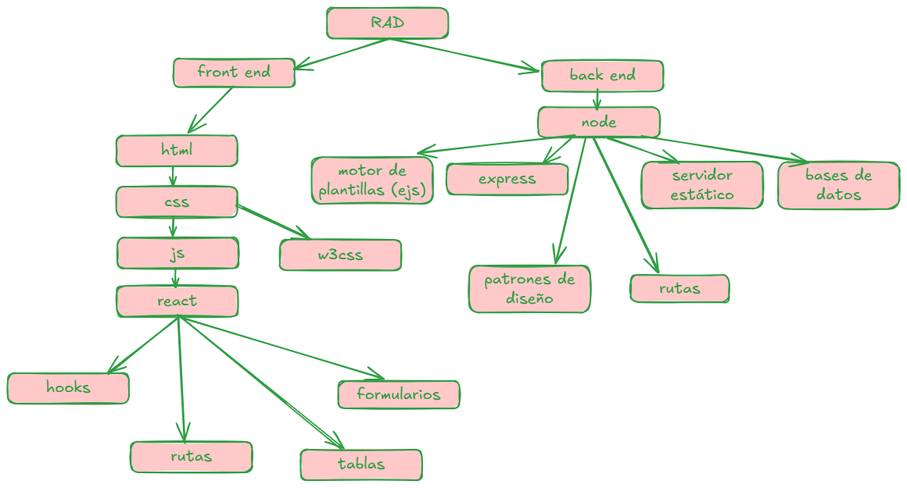

# Desarrollo rápido de aplicaciones (RAD)

El Desarrollo Rápido de Aplicaciones (RAD, por sus siglas en inglés: Rapid Application Development) es una metodología de desarrollo de software que prioriza la velocidad y la flexibilidad sobre procesos rígidos, permitiendo crear prototipos funcionales en poco tiempo y refinarlos iterativamente con feedback continuo.

## Conceptos Clave del RAD

* Prototipado rápido:

* Se construyen versiones simplificadas (mockups o MVPs) para validar ideas rápidamente.
* Ejemplo: Usar herramientas como Figma (para UI) o Low-Code (para lógica).
* Iteraciones cortas y feedback constante:
* Ciclos de desarrollo ágiles (sprints de 1-2 semanas).
* Involucrar al cliente/usuario desde el inicio.
* Herramientas y frameworks optimizados:
* Uso de tecnologías que aceleran el desarrollo (ej: React, Flutter, Laravel).

Low-code: Se trata de construir código por medio de interfaces muy visuales y muy intuitivas. Se basan en un principio modular en el que se pueden arrastrar estructuras enteras con el ratón —el denominado “drag and drop”— y con una serie de componentes ya creados en forma de plantillas. Esto facilita la construcción de flujos de información, la presentación de datos de forma vistosa o la automatización de acciones.

Automatización:

* CI/CD (Continuous Integration/Delivery), generadores de código, plantillas.

## Técnicas y Herramientas para RAD

1. Frameworks de Desarrollo Web

* Frontend: React, Vue.js, Svelte (JSX/components = reutilización).
* Backend: Express (Node.js), Django (Python), Ruby on Rails (Convención sobre configuración).
* Full-Stack: Next.js, Nuxt.js, Laravel (PHP).

2. Plataformas Low-Code/No-Code

Para aplicaciones simples sin código complejo:

* Web: Bubble, Webflow.
* Móvil: Adalo, Thunkable.
* Bases de datos: Airtable, Firebase.

3. Generadores de Código y Plantillas
Ejemplos:

* create-react-app (para iniciar proyectos React en segundos).

* Angular CLI o Laravel Sail (entornos preconfigurados).

4. Backend como Servicio (BaaS)
* Firebase, Supabase, AWS Amplify (autenticación, DB, APIs sin infraestructura).

5. Desarrollo Móvil Rápido
* Híbridos: Ionic, Flutter (un código para iOS/Android).

Nativos: React Native, Kotlin Multiplatform.

## Ejemplo de Flujo RAD

* Día 1: Crear un prototipo en Figma (herramienta de diseño colaborativo basada en la nube) + Firebase(plataforma de desarrollo de aplicaciones creada por Google).
* Semana 1: Desplegar un MVP con React + Express.
* Semana 2: Añadir autenticación (ej: Auth0) y feedback de usuarios.
* Semana 3: Refinar características basadas en datos reales.

## Limitaciones del RAD

* No ideal para proyectos críticos/complejos: Ej: sistemas bancarios o de misión crítica.
* Riesgo de código descuidado: Si no se refactoriza.
* Dependencia de herramientas: Algunas plataformas Low-Code limitan la escalabilidad.

## plan del curso

