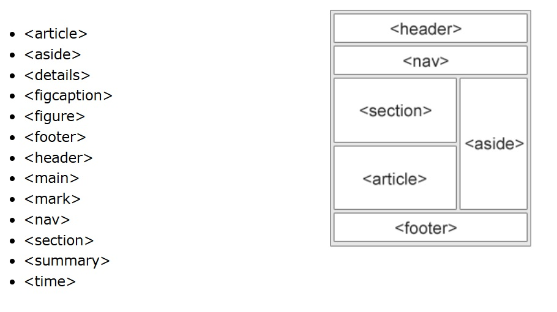

# html

HTML no es un lenguaje de programación; es un lenguaje de marcado que define la estructura de tu contenido. HTML consiste en una serie de elementos que usarás para encerrar diferentes partes del contenido para que se vean o comporten de una determinada manera.

Un elemento HTML se distingue de otro texto en un documento mediante "etiquetas", que consisten en el nombre del elemento rodeado por "\<" y "\>". El nombre de un elemento dentro de una etiqueta, no distingue entre mayúsculas y minúsculas. Es decir, se puede escribir en mayúsculas, minúsculas o una mezcla. Por ejemplo, la etiqueta \<title\> se puede escribir como \<Title\>, \<TITLE\> o de cualquier otra forma.

Los elementos HTML suelen ser elementos "en línea" o "a nivel de bloque". Un elemento en línea ocupa solo el espacio delimitado por las etiquetas que lo definen. Un elemento a nivel de bloque ocupa todo el espacio de su elemento padre (contenedor), creando así un "bloque".

Los elementos en HTML tienen atributos. Se trata de valores adicionales que configuran los elementos o ajustan su comportamiento de diversas formas.

[referencia de atributos html](https://developer.mozilla.org/es/docs/Web/HTML/Reference/Attributes)

Ejemplo:

si desea que el mensaje: hola mundo, sea un parrafo en html se encierra así:

```html
<p>hola mundo</p>
```
El parrafo es un elemento de bloque.

Vea un Hoja de trucos de HTML para sintaxis y tareas comunes en: 
[liga](https://developer.mozilla.org/es/docs/Learn_web_development/Getting_started/Your_first_website/Creating_the_content)

## documento html

Un documento html se escribe así:

```html
<!doctype html>
<html>
  <head>
    <meta charset="utf-8" />
    <title>Mi pagina de prueba</title>
  </head>
  <body>
    <p>hola mundo</p>
  </body>
</html>

```

## elementos en bloque

div
pre
p
h1 .. h6
hr
header
nav
main
section
article
aside
footer
address
canvas
figure
form
fieldset
table
ul
ol
li


## elementos inline

a
br
button
img
span
input
strong
b
label
select
textarea

## titulos

```html
<h1>Mi título principal</h1>
<h2>Mi título de nivel superior</h2>
<h3>Mi subtítulo</h3>
<h4>Mi sub-subtítulo</h4>
<!--listas no ordenadas-->

<ul>
  <li>tecnólogos</li>
  <li>pensadores</li>
  <li>constructores</li>
</ul>

<!--vinculos-->
<a href="https://www.mozilla.org/es-AR/about/manifesto/">Manifesto Mozilla</a>

```

## div

El elemento div es por default un elemento de bloque


## atributos

Los elementos en HTML tienen atributos; estos son valores adicionales que configuran los elementos o ajustan su comportamiento de diversas formas para cumplir los criterios de los usuarios.

[resumen de atributos](https://developer.mozilla.org/es/docs/Web/HTML/Reference/Attributes)

ejemplo:
atributo id sirve para identificar de manera única un elemento html en la página.
atributo class sirve para agrupar elementos html que tendrán características similares.

```html
  <div id="resumen" class="section"></div>
```

## tablas

```html
<!DOCTYPE html>
<html>
  <head>
    <style>
      table {
        font-family: arial, sans-serif;
        border-collapse: collapse;
        width: 100%;
      }

      td, th {
        border: 1px solid #dddddd;
        text-align: left;
        padding: 8px;
      }

      tr:nth-child(even) {
        background-color: #dddddd;
      }
    </style>
  </head>
  <body>

    <h2>HTML Table</h2>

    <table>
      <tr>
        <th>Company</th>
        <th>Contact</th>
        <th>Country</th>
      </tr>
      <tr>
        <td>Alfreds Futterkiste</td>
        <td>Maria Anders</td>
        <td>Germany</td>
      </tr>
      <tr>
        <td>Centro comercial Moctezuma</td>
        <td>Francisco Chang</td>
        <td>Mexico</td>
      </tr>
      <tr>
        <td>Ernst Handel</td>
        <td>Roland Mendel</td>
        <td>Austria</td>
      </tr>
      <tr>
        <td>Island Trading</td>
        <td>Helen Bennett</td>
        <td>UK</td>
      </tr>
      <tr>
        <td>Laughing Bacchus Winecellars</td>
        <td>Yoshi Tannamuri</td>
        <td>Canada</td>
      </tr>
      <tr>
        <td>Magazzini Alimentari Riuniti</td>
        <td>Giovanni Rovelli</td>
        <td>Italy</td>
      </tr>
    </table>
  </body>
</html>
```

## formularios

```html
<form action="/action_page.php">
  <label for="fname">First name:</label><br>
  <input type="text" id="fname" name="fname" value="John"><br>
  <label for="lname">Last name:</label><br>
  <input type="text" id="lname" name="lname" value="Doe"><br><br>
  <input type="submit" value="Submit">
</form>
```

## atributo  target

Se usa para indicar donde se muestra la respuesta despues del submit

El atributo target puede tener uno de los siguientes valores:

Valor	Descripción
_blank	  The response is displayed in a new window or tab
_self	    The response is displayed in the current window
_parent	  The response is displayed in the parent frame
_top	    The response is displayed in the full body of the window
framename	The response is displayed in a named iframe

El default es _self que indica que la respuesta se muestra en la ventana actual.

## html semantico




## referencias

[html](https://www.w3schools.com/html/)